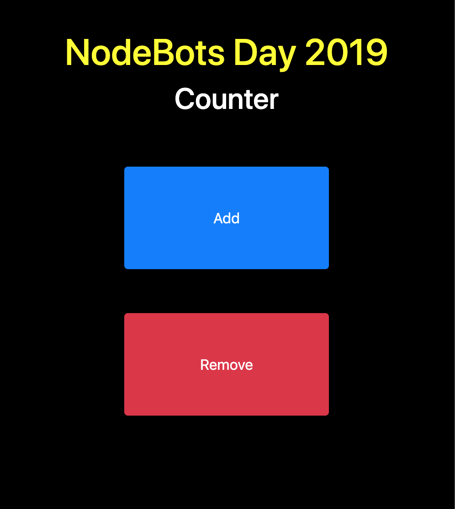

# nodebots-hackaton

Simple people counter for events.  

[](https://www.youtube.com/watch?v=n3qfNKKpsBc)  



## Running the server  

```bash
npm i
npm start
```

## Running the frontend separately  

```bash
cd frontend
http-server
```

## Exposing to the world  

```bash
ssh -R 80:localhost:3000 nodecounter@ssh.localhost.run
```

## Public Url  

https://nodecounter.localhost.run

## Public URL slides

https://docs.google.com/presentation/d/1KqoH1Z-VmT3IwdA5q7Qh5sIv_oFW799YYy-Fd2l6fy8/edit?usp=sharing